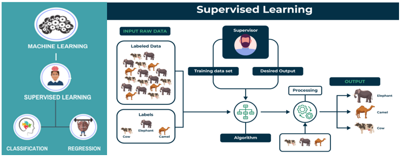
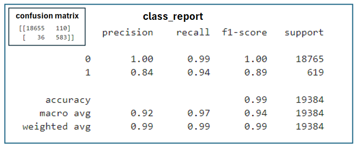

# ds_module_20_Supervised_Learning
Homework Module 20 - Supervised Machine Learning, Classification Models
=========
Objective
----
The goal of this project is to use supervised learning models for predicting continuous outcomes and to assess how well classification models, like logistic regression, work.

In short words a supervised learning model is a type of machine learning where the model is trained on labeled data, meaning it learns from examples that include both the input features and the correct output. The goal is for the model to make accurate predictions or classifications on new, unseen data based on what it has learned.

For this challenge, we will use different methods to train and evaluate a model that assesses loan risk. We will work with a dataset of past lending activity from a peer-to-peer lending service to build a model that can determine how creditworthy borrowers are.

Instructions
---
The instructions for this Challenge are divided into the following subsections:

- Split the Data into Training and Testing Sets

- Create a Logistic Regression Model with the Original Data

- Write a Credit Risk Analysis Report

Split the Data into Training and Testing Sets
---

Open the starter code notebook and use it to complete the following steps:

1. Read the lending_data.csv data from the Resources folder into a Pandas DataFrame.

2. Create the labels set (y) from the “loan_status” column, and then create the features (X) DataFrame from the remaining columns.

NOTE
- A value of 0 in the “loan_status” column means that the loan is healthy. 
- A value of 1 means that the loan has a high risk of defaulting.

3. Split the data into training and testing datasets by using train_test_split.

Create a Logistic Regression Model with the Original Data
---
Use your knowledge of logistic regression to complete the following steps:

1. Fit a logistic regression model by using the training data (X_train and y_train).

2. Save the predictions for the testing data labels by using the testing feature data (X_test) and the fitted model.

3. Evaluate the model’s performance by doing the following:

    - Generate a confusion matrix.

    - Print the classification report.

4. Answer the following question: How well does the logistic regression model predict both the 0 (healthy loan) and 1 (high-risk loan) labels?

Write a Credit Risk Analysis Report
--- 
Write a brief report that includes a summary and analysis of the performance of the machine learning models that you used in this homework. You should write this report as the README.md file included in your GitHub repository.

Structure your report by using the report template that Starter_Code.zip includes, ensuring that it contains the following:

1. **An overview of the analysis:** Explain the purpose of this analysis.

2. **The results:** Using a bulleted list, describe the accuracy score, the precision score, and recall score of the machine learning model.

3. **A summary:** Summarize the results from the machine learning model. Include your justification for recommending the model for use by the company. If you don’t recommend the model, justify your reasoning.

  

Analysis of Machine Learning Models Used for the Evaluation
===

Purpose of the Analysis
---
The goal of this analysis was to build and evaluate a machine learning model to predict borrowers' creditworthiness using historical data from a peer-to-peer lending company. The primary objective was to classify loans into two categories: healthy loans (0) and high-risk loans (1). This classification helps the company minimize financial losses by accurately identifying higher-risk loans.

Logistic regression was employed to differentiate between healthy and high-risk loans. The model estimates the probability of a loan falling into one of these categories, providing a systematic approach to predict creditworthiness.

**Results**

The logistic regression model performed effectively in evaluating loan risk. Please see the results:

For the **confusion matrix** indicates that the model performs well, accurately identifying the majority of both positive and negative cases. It shows only a small number of misclassifications overall, reflecting strong overall performance.

- Overall Accuracy: 
    - The model achieved an accuracy of 99%, indicating it correctly predicts loan outcomes 99% of the time.

- Precision:

    - Healthy Loans (0): The model has a precision of 100%, meaning every prediction of a healthy loan is accurate.
    - High-Risk Loans (1): The precision is 84%, so 84% of the time the model correctly identifies a high-risk loan.

- Recall:

     - Healthy Loans (0): The model correctly identifies 99% of actual healthy loans.
    - High-Risk Loans (1): The model detects 94% of actual high-risk loans, missing 6%, very few errors.

- F1-Score:

     - Healthy Loans (0): The F1-score is very high, reflecting both precision and thoroughness in identifying healthy loans.
    - High-Risk Loans (1): The F1-score is strong, balancing precision and recall for high-risk loans, though there’s room for improvement.

**Summary**

Logistic regression is a recommended model for assessing loan risk due to its excellent overall performance. It is particularly effective at identifying both healthy and high-risk loans, making it a strong choice for predicting borrower creditworthiness the peer-to-peer lending service.

- High-Risk Loans: The model effectively identifies 94% of high-risk loans, crucial for minimizing financial losses.
- Healthy Loans: It accurately classifies nearly all healthy loans, ensuring reliability in identifying low-risk borrowers.

Given the model’s strong performance in both categories, I affirm that logistic regression is a robust tool for analyzing loan approval or rejection.

Using this model would help prevent losses from loans that should not be approved.

  
  
  

References
- Office hours